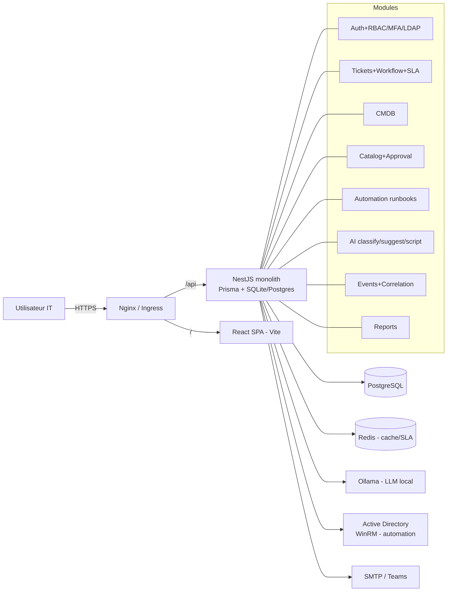

# Démo — TwisterITSM

Plateforme ITSM modulaire (NestJS + Prisma + React/Vite) déployable on-premise.
Cette page présente l'interface réelle (captures), l'architecture, et comment
lancer le stack complet pour voir toutes les vues (Dashboard, Tickets, CMDB,
Automation, Copilote IA).

## Captures d'écran (UI réelle)

L'interface est **bilingue FR/EN** (sélecteur dans la sidebar), **accessible**
(labels `<label>` + `id`, skip-link, `nav aria-label`, `role="alert"`, focus
visible) et propose un **thème clair/sombre** (toggle dans la sidebar).

| Écran | Capture |
| --- | --- |
| Connexion — **FR** (labels Email / Mot de passe / Connexion) |  |
| Connexion — **EN** (labels Email / Password / Sign in) |  |

> Les vues internes (Dashboard, Tickets, CMDB, Automation, Copilote IA) sont
> rendues côté client à partir de l'API REST. Pour les capturer en conditions
> réelles, lancez le stack complet (voir « Lancer la démo ») : le frontend se
> connecte alors à `/api` (Postgres + Redis + Ollama requis pour les données
> et l'IA).

## Architecture (monolithe modulaire)



## Parcours ITIL de bout en bout

La vue **Tickets** expose le flux complet et le rend visible :

1. **Créer** le ticket (formulaire riche : type, priorité, catégorie, erreur,
   asset, utilisateurs affectés, champs technicien…).
2. **Classification IA** automatique (`POST /ai/classify`) qui remplit la
   catégorie si l'utilisateur ne l'a pas fixée — badge « Classifié par IA ».
3. **Piste d'audit** : chaque modification est tracée (`ticket_history`),
   affichée dans le panneau latéral (qui a fait quoi, quand).

Le **Dashboard** résume le flux (tickets ouverts, MTTR, répartition par statut,
CMDB, jobs d'automation) et affiche un panneau « Parcours ITIL ».

## Lancer la démo

Prérequis : Docker + Docker Compose (ou K3s), et éventuellement Ollama pour
l'IA locale.

```bash
# 1. Démarrer l'infra (Postgres, Redis, API, Web, Nginx)
docker compose up -d

# 2. Appliquer le schéma et seeder
cd apps/api && npx prisma migrate deploy && npx prisma db seed

# 3. Ouvrir l'interface
#    http://localhost:8080  (ou l'ingress itsm.twisterlab.local en K8s)
```

Variables d'environnement clés (voir `.env.example`) :
`DATABASE_URL`, `JWT_SECRET`, `REDIS_URL`, `OLLAMA_BASE_URL`,
`SMTP_*` / `TEAMS_WEBHOOK_URL`, `AD_*` (automation AD en dry-run par défaut).

> ⚠️ Aucun secret n'est committé. Voir `docs/SECRETS.md` pour la gestion des
> credentials (K8s Secret hors git, placeholders dans les ConfigMaps).

## Authentification (démo locale)

Le frontend stocke le JWT dans `localStorage` (`itsm_token`). En dev, un
compte admin (`admin@twisterlab.local`, permissions `admin:*`) suffit pour
parcourir toutes les vues. MFA TOTP et sync LDAP sont implémentés côté API.

## Tests & CI

- `npm test --workspace @twisteritsm/api` → 23 tests unitaires
  (connecteur AD, workflow SLA, MFA) — 100 % verts.
- GitHub Actions (`.github/workflows/ci.yml`) : `npm ci` → build → test sur
  Node 20. Badge :


