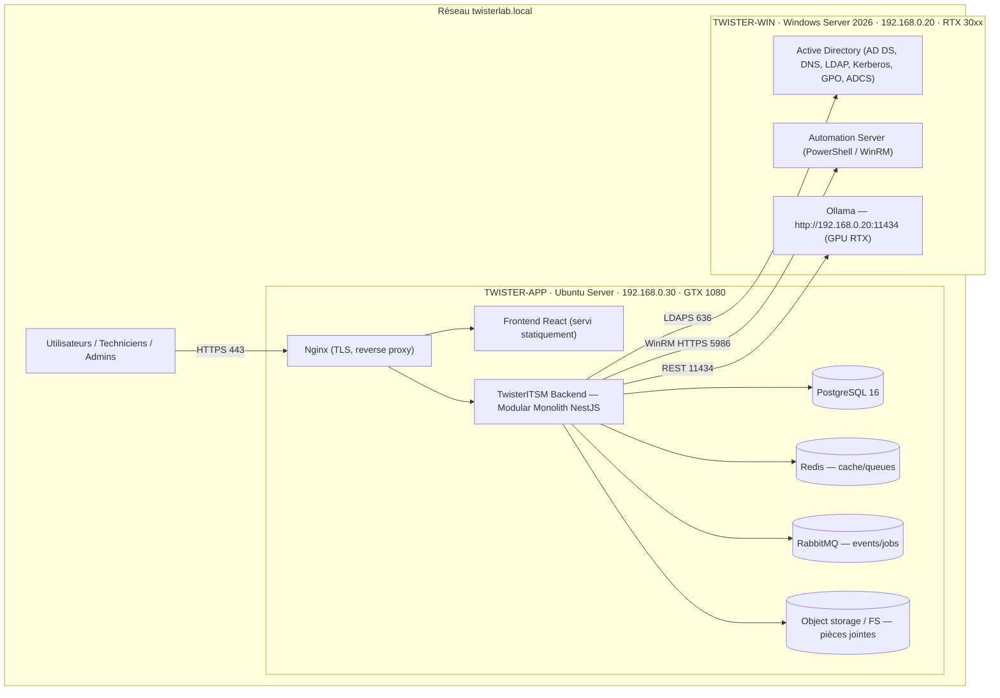
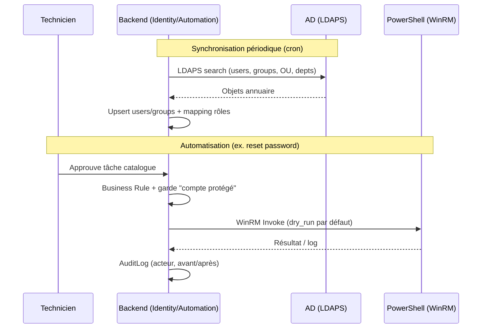
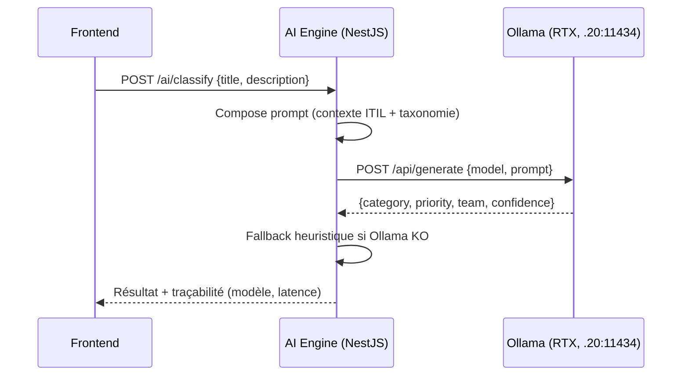
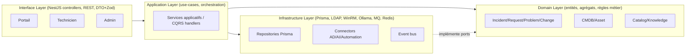
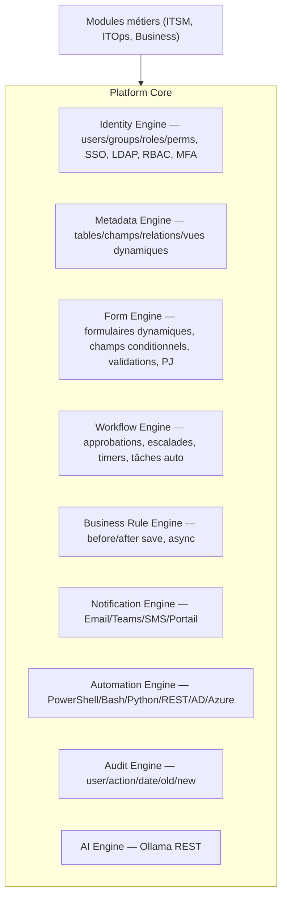
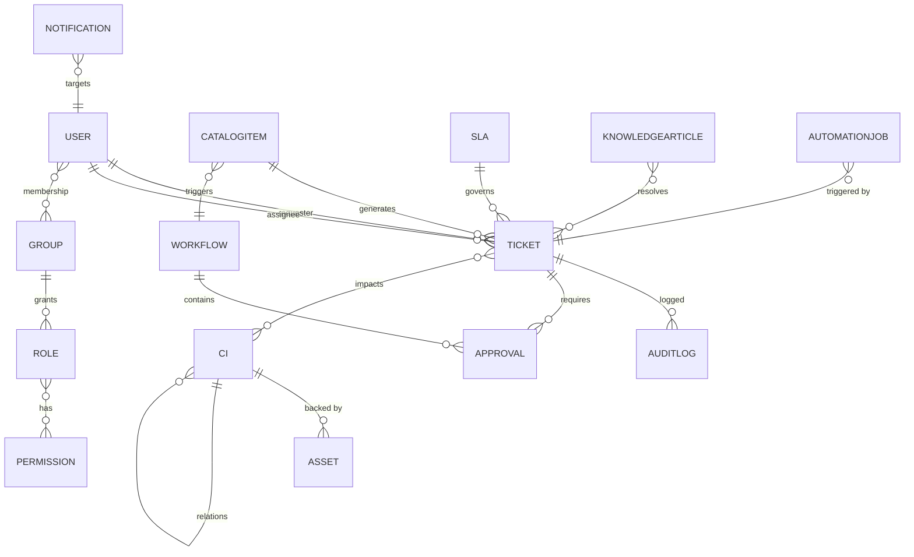
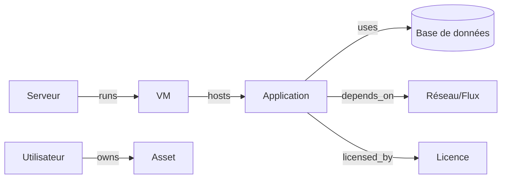
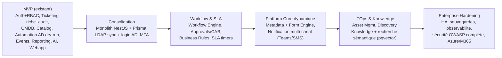

# TwisterITSM — Enterprise Architecture Document

> Digital Workflow Platform ITSM On-Premise — alternative à ServiceNow / BMC Helix / Jira SM.
> Domaine d'identité central : `twisterlab.local`.
>
> **Statut : LIVRÉ** — Modular Monolith NestJS + Prisma (voir `README.md`). Les
> modules `identity`, `ticketing`, `cmdb`, `catalog`, `automation`, `events`,
> `workflow`, `reporting`, `ai`, `notifications` sont implémentés et testés.
> Aucun secret réel n'est présent dans le dépôt (voir `docs/SECRETS.md`).

---

## 0. Réconciliation avec l'existant (consolidation des 9 microservices → monolithe)

Le dépôt a consolidé les 9 microservices Express d'origine en **1 Modular Monolith
NestJS + Prisma** (commit `feat(E1)`). Le modèle de données (schémas normalisés
`db/migrations/00x_*.sql`) a été réutilisé comme baseline Prisma (`prisma db pull`).

| Ancien (microservices Express + `pg`) | Décision | État |
|---|---|---|
| `services/auth-service` (JWT+RBAC+bcrypt) | **Refondu** en module `identity` NestJS | ✅ (RBAC, MFA TOTP, LDAP sync) |
| `services/ticketing-service` (NestJS + `pg`) | **Migré** en module `ticketing` | ✅ (tickets + audit acteur) |
| `cmdb / catalog / automation / events / reporting / ai` (Express) | **Absorbés** en modules du monolithe | ✅ |
| `gateway` (Express proxy) | **Remplacé** par Nginx + routing NestJS | ✅ |
| `frontend/webapp` (React+Vite+Tailwind) | **Conservé** | ✅ |

**Principe** : un seul process applicatif (moins d'ops), mêmes frontières de
domaine, Prisma comme ORM. La séparation en modules garde la possibilité
théorique d'extraire un service plus tard sans réécrire le domaine.

---

## 1. Vision & périmètre

TwisterITSM n'est pas un outil de tickets : c'est une **plateforme de workflows numériques** avec moteur de données dynamique, moteur de formulaires, moteur de workflows, règles métier, CMDB, catalogue, automatisation, IA, reporting et intégrations.

Domaines fonctionnels :
- **ITSM** : Incident, Request, Problem, Change, SLA, Catalogue, Knowledge.
- **IT Operations** : CMDB, Assets, Monitoring, Automation, Discovery.
- **Business Services** : RH, Finance, Direction, Opérations.
- **IA** : classification, assistant technicien, génération de scripts, analyse de tendances, recherche intelligente.

---

## 2. Infrastructure physique cible

| Serveur | Rôle | Détails |
|---|---|---|
| **TWISTER-WIN** `192.168.0.20` | Identité + Automation + IA | AD DS/DNS/LDAP/Kerberos/GPO, PowerShell/WinRM, Ollama (GPU RTX) |
| **TWISTER-APP** `192.168.0.30` | Applicatif | Nginx, Backend NestJS, Frontend, PostgreSQL, Redis, RabbitMQ, fichiers |

---

## 3. Flux réseau

| Source | Destination | Port / Protocole | Usage |
|---|---|---|---|
| Utilisateur | Nginx (`.30`) | 443 / HTTPS | Accès portail & API |
| Backend (`.30`) | AD (`.20`) | 636 / LDAPS | Sync identités, bind auth |
| Backend (`.30`) | Automation (`.20`) | 5986 / WinRM HTTPS | Exécution PowerShell |
| Backend (`.30`) | Ollama (`.20`) | 11434 / HTTP(S) | Inférence IA |
| Backend | PostgreSQL | 5432 (local) | Persistance |
| Backend | Redis | 6379 (local) | Cache, rate-limit, timers |
| Backend | RabbitMQ | 5672 (local) | Bus d'événements, jobs async |

> Durcissement : WinRM et Ollama exposés **uniquement** sur le VLAN interne ; secrets (bind LDAP, compte automation) en coffre (Vault / fichiers chiffrés hors Git).

---

## 4. Flux Active Directory

Fonctions : sync utilisateurs/groupes/départements, création/modif/désactivation comptes, gestion appartenance groupes, onboarding/offboarding. **Règles dures** : `dry_run=true` par défaut, exécution réelle exige un flag explicite + variable serveur, comptes sensibles (`Administrator`, comptes de service) refusés.

---

## 5. Flux IA (Ollama)

Cas d'usage : classification, suggestion de résolution, résumé, génération PowerShell/Bash, analyse d'incidents récurrents, assistant conversationnel, recherche sémantique (pgvector). **Résilience** : tout endpoint IA a un fallback déterministe (déjà implémenté) → jamais de blocage si le GPU est indisponible.

---

## 6. Architecture logicielle (Modular Monolith + Clean Architecture)

Principes : **DDD**, **Clean Architecture** (dépendances vers l'intérieur), **SOLID**, **Event-Driven** (RabbitMQ), **API-First**, **Security-by-Design**, **Audit-by-Design**. Chaque module métier expose des *ports* (interfaces) que l'infrastructure implémente → testabilité et migration future vers microservices sans réécrire le domaine.

---

## 7. Platform Core — moteurs transverses

| Moteur | Rôle clé | État actuel |
|---|---|---|
| Identity | RBAC + LDAP + MFA + SSO | ✅ RBAC, LDAP sync, MFA TOTP livrés |
| Metadata | Définir tables/champs à chaud | À concevoir (P4) |
| Form | Formulaires dynamiques conditionnels | Statique aujourd'hui → dynamique (P4) |
| Workflow | Approbations/escalades/timers | Approbation catalogue simple ✅ → moteur générique |
| Business Rule | Hooks before/after/async | À formaliser |
| Notification | Multi-canal | SMTP connector ✅ → Teams/SMS |
| Automation | Multi-runtime + AD | AD PowerShell dry-run ✅ |
| Audit | Traçabilité complète | Acteur+avant/après ✅ |
| AI | Ollama + fallback | ✅ (heuristique + LLM) |

---

## 8. Modules métiers

- **Incident Management** : création, affectation, priorité, SLA, résolution.
- **Request Management** : demandes catalogue + approbations.
- **Problem Management** : RCA, Known Errors, liaison incidents.
- **Change Management** : CAB, approbations, évaluation risque, rollback.
- **CMDB** : serveurs, VM, apps, bases, réseaux, licences, utilisateurs + relations.
- **Asset Management** : matériel, logiciels, licences, cycle de vie.
- **Knowledge Management** : FAQ, procédures, articles + recherche sémantique.

---

## 9. Modèle de données initial

Entités : `User, Group, Role, Permission, Ticket (Incident/Request/Problem/Change via type), Service, CatalogItem, Workflow, Approval, CI, Asset, KnowledgeArticle, SLA, Notification, AuditLog, AutomationJob`. Chaque table : PK UUID, timestamps, `created_by/updated_by`, index sur FK + colonnes de filtre, contraintes FK + CHECK enums. Baseline déjà présente dans `db/migrations/00x_*.sql` (schémas `auth/users/ticketing/cmdb/catalog/automation/events`).

---

## 10. CMDB

CI génériques (classe + attributs JSONB validés par le Metadata Engine) + table de relations typées (`runs_on`, `depends_on`, `hosts`, …). Base déjà implémentée (filtres JSONB `@>`). Ajouts cibles : impact/dépendance graphique, Discovery via AD + agents.

---

## 11. Catalogue de services initial

| Domaine | Sous-domaine | Items |
|---|---|---|
| IT — Poste | | Nouveau PC, Logiciel, Périphérique, VPN |
| IT — Comptes | | Création compte AD, Modif droits, Suppression compte, Reset password |
| IT — Réseau | | Ouverture de flux, Certificat, Accès |
| RH | | Attestation, Modification données, Demandes RH |
| Finance | | Budget IT, Centre de coût, Rapports |
| Direction | | KPI, Dashboards |

Chaque item = formulaire (Form Engine) + workflow (Workflow Engine) + éventuel runbook (Automation Engine). Les items "Comptes" déclenchent les runbooks AD **en dry-run** par défaut.

---

## 12. Sécurité (Security & Audit by Design)

- **AuthN** : LDAP/Kerberos via AD, JWT (RS256 cible), **MFA** (TOTP).
- **AuthZ** : RBAC (rôles/permissions), row-level scoping (un demandeur ne voit que ses tickets — déjà en place).
- **Transport** : HTTPS partout, LDAPS 636, WinRM HTTPS 5986.
- **Secrets** : coffre (Vault) ou fichiers chiffrés hors Git ; jamais de credentials dans le code/`.env` versionné.
- **OWASP Top 10** : validation Zod/DTO, requêtes paramétrées (déjà), rate-limiting Redis, CSP Nginx, CSRF sur sessions.
- **Audit** : chaque écriture métier → `AuditLog(acteur, action, date, ancienne/nouvelle valeur)` (déjà implémenté sur ticketing).
- **Automation** : garde-fou comptes protégés + dry-run (déjà implémenté).

---

## 13. Roadmap MVP → Enterprise

---

## 14. Plan de développement par étapes

| Étape | Livrables | Critère de sortie |
|---|---|---|
| **E1 — Consolidation** | Monolith NestJS, Prisma sur schéma existant, modules incident/request/problem/change | Build vert + E2E tickets rejoués |
| **E2 — Identity Enterprise** | LDAP sync (LDAPS), login AD, MFA TOTP, RBAC affiné | Connexion via compte AD réel de test + MFA |
| **E3 — Workflow & SLA** | Workflow Engine (approbations/escalades/timers), CAB, SLA + breaches | Change avec CAB approuvé + SLA calculé |
| **E4 — Business Rules & Notifications** | Rule Engine (before/after/async), Notifications Email/Teams | Règle "auto-assign" + notif Teams déclenchée |
| **E5 — Platform Core dynamique** | Metadata + Form Engine (formulaires conditionnels) | Créer un type de demande sans coder |
| **E6 — ITOps & Knowledge** | Asset Mgmt, Discovery AD, Knowledge + pgvector | Discovery peuple la CMDB ; recherche IA d'articles |
| **E7 — Enterprise Hardening** | HA, backups, observabilité (Prometheus/Grafana), OWASP, Azure/M365 | Tests de charge + audit sécurité passés |

---

## 15. Cohérence permanente (règles d'or)

- `192.168.0.20` = **AD + IA + Automation** (Windows).
- `192.168.0.30` = **applicatif** (Ubuntu).
- `twisterlab.local` = **identité centrale**.
- Toute nouvelle fonctionnalité respecte : DDD, Clean Archi, Event-Driven, API-First, Security & Audit by Design.
- IA : toujours un fallback déterministe si Ollama indisponible.
- Automation AD : dry-run par défaut, comptes protégés refusés.

---

## 16. Cohérence avec le code livré

Cette documentation décrit l'architecture **telle qu'implémentée** (modular
monolith, modules listés en section 0). Les endpoints réels sont dans
`docs/API.md`. Aucun secret réel n'est committé (voir `docs/SECRETS.md`).
